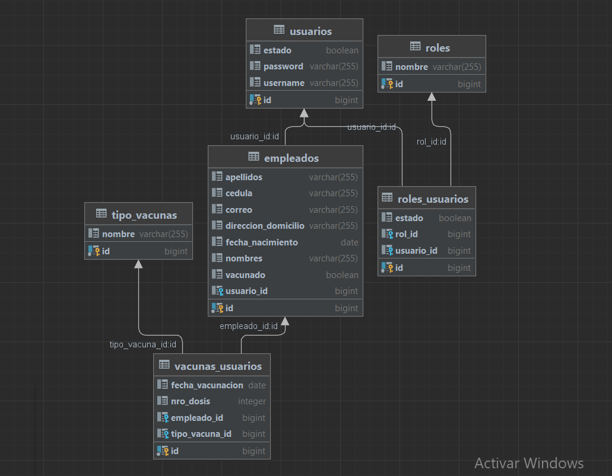

# Reto Kruger Corporation

## Construcción de aplicación
- Crear repositorio
- Crear proyecto
- Diseñar modelo de datos
- Crear las Entidades
- Agregar la validación por campos
- Agregar la configuración de la conexión a la base de datos en el archivo properties
- Crear un archivo .sql para que se ejecute al iniciar el proyecto
- Crear los repositories de las entidades
- Crear los services de las entidades con los métodos crud
- Crear el controller para empleados
- Crear los dtos necesarios 
- Agregar las consultas específicas en los repositories

### Diagrama de Modelo de datos

### Documentación con Swagger
- Agregar las dependencias para el manejo de swagger
- Crear la clase configuración para realizar la documentación con swagger
- Realizar la documentación en el controller y las entidades
- Para acceder http://localhost:8080/swagger-ui.html

## Ejecución de la aplicación
- Clonar el proyecto
- Modificar la configuración de la conexión a la base de datos
- Ejecutar el proyecto
